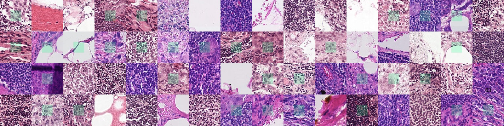

# GANs VS. Latent Diffusion Models

<!--

--> 

> A comparative analysis of latent diffusion models and generative adversarial networks for cost-effective generation of medical images (using PCam) dataset.

Dataset utilizado é o PatchCamelyon (PCAM) disponível em [torchvision dataset](https://pytorch.org/vision/stable/generated/torchvision.datasets.PCAM.html)
